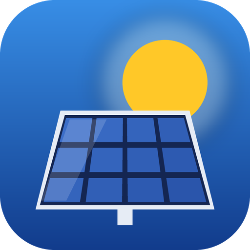

<p align="center">
  
</p>

<h1 align="center">Solenso pour Home Assistant</h1>

<p align="center">
  <a href="https://github.com/pismache/ha-solenso/releases"></a>
  <a href="https://github.com/hacs/integration"></a>
  <a href="https://github.com/pismache/ha-solenso/actions/workflows/validate.yml"></a>
  <a href="LICENSE"></a>
</p>

Intégration non officielle pour les centrales photovoltaïques **Solenso** suivies sur [monitor.solenso.net](https://monitor.solenso.net) : production de la centrale et détail de chaque micro-onduleur, directement dans Home Assistant et son tableau Énergie.

> Solenso est une marque de micro-onduleurs basée sur la plateforme Hoymiles. Ce projet n'est ni affilié ni soutenu par Solenso ou Hoymiles.

## Installation

### Avec HACS (recommandé)

[](https://my.home-assistant.io/redirect/hacs_repository/?owner=pismache&repository=ha-solenso&category=integration)

Ou à la main : HACS → menu ⋮ → **Dépôts personnalisés** → `https://github.com/pismache/ha-solenso`, catégorie **Intégration** → installer **Solenso** → redémarrer Home Assistant.

### Manuelle

Copier le dossier `custom_components/solenso` dans `/config/custom_components/`, puis redémarrer Home Assistant.

## Configuration

[](https://my.home-assistant.io/redirect/config_flow_start/?domain=solenso)

Paramètres → Appareils et services → **Ajouter une intégration** → **Solenso**, puis l'e-mail et le mot de passe du compte monitor.solenso.net.

Les centrales du compte sont détectées automatiquement. Sinon, renseigner l'**identifiant de la centrale** : c'est le nombre après `id=` dans l'adresse de sa page (`…/station/view/detail?id=1234567`).

## Ce que vous obtenez

Les appareils sont organisés comme l'installation : **centrale → passerelle DTU → micro-onduleurs**.

### Centrale

| Capteur | Unité | Remarque |
|---|---|---|
| Puissance | W | forcée à 0 sans remontée depuis 1 h (la nuit) |
| Production du jour / du mois / de l'année | kWh | |
| Production totale | kWh | **à utiliser dans le tableau Énergie** |
| Dernière remontée | horodatage | diagnostic |

### Micro-onduleurs

| Capteur | Unité | Remarque |
|---|---|---|
| Puissance | W | |
| Production du jour | kWh | |
| Tension panneau / Courant panneau | V / A | par entrée PV si l'onduleur en a plusieurs |
| Température | °C | |
| Tension réseau / Fréquence réseau | V / Hz | diagnostic |
| Dernière remontée | horodatage | diagnostic |

Les mesures des onduleurs arrivent par pas de 15 minutes. Sans nouveau point depuis 45 minutes (la nuit), puissance, tension et courant passent à 0 et la température devient inconnue ; la production du jour reste acquise jusqu'à minuit.

### Passerelle DTU

| Capteur | Remarque |
|---|---|
| Connexion au cloud | la DTU communique-t-elle avec les serveurs ? |

## Carte « Panneau solaire »

L'intégration fournit sa propre carte, chargée automatiquement : rien à ajouter dans les ressources du tableau de bord.

Dans un tableau de bord : **Ajouter une carte** → chercher **Solenso**. Le panneau s'éclaire selon la production de chaque micro-onduleur ; un panneau sombre produit moins que les autres. Un clic sur un panneau, la puissance ou un chiffre de la plaque ouvre l'historique correspondant.

```yaml
type: custom:solenso-card
device_id: …          # la centrale (choisie dans l'éditeur visuel)
columns: 8            # facultatif : grille simple au lieu du plan Solenso
peak_power: 350       # puissance crête d'un panneau, pour l'éclairage
show_panels: true     # false : un seul grand panneau pour toute la centrale
show_values: true     # watts affichés sur chaque panneau
```

Les panneaux sont placés **comme sur le toit**, d'après la page « Agencement » de monitor.solenso.net : l'intégration lit la position de chaque micro-onduleur (attributs `layout_row`, `layout_column` et `layout_array` de son capteur de puissance). Avec plusieurs toitures, chacune forme un bloc. Les onduleurs sans position, ou toute la centrale si l'agencement n'est pas renseigné chez Solenso, sont rangés par nom d'appareil. Indiquer `columns` impose une grille simple à la place du plan.

## Tableau Énergie

Dans Paramètres → Tableaux de bord → Énergie → **Production solaire**, choisir le capteur **Production totale** de la centrale, et sa **Puissance** pour la puissance instantanée.

Le cloud Solenso ne recalcule les cumuls mois / année / total qu'en différé ; la puissance et la production du jour sont plus réactives.

## Fonctionnement

- Données lues dans le cloud toutes les 5 minutes (pas d'accès local à la DTU).
- Connexion comme la page web : le mot de passe est envoyé haché, jamais en clair. Le jeton de session est renouvelé automatiquement ; si le mot de passe change, Home Assistant propose de le ressaisir.
- Les données par onduleur viennent de l'API Hoymiles utilisée par la page « Agencement » de monitor.solenso.net (réponse protobuf décodée dans `module_pb.py`).

## Développement

```bash
pip install -r requirements-test.txt
pytest
```

Les versions sont listées dans le [journal des versions](CHANGELOG.md).
